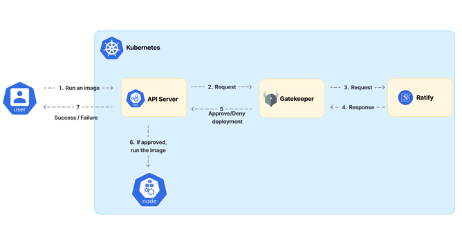

## SBOM Admission Policy Demo

This demo showcases how to use [Snyk](snyk.io) container sbom feature alongside Gatekeeper (OPA) and Ratify to ensure that only images with valid SBOMs are deployed to a Kubernetes environments.

The [snyk container sbom](https://docs.snyk.io/snyk-cli/commands/container-sbom) feature generates an SBOM for a container image.

Supported formats include CycloneDX v1.4 (JSON or XML), CycloneDX v1.5 (JSON or XML) and SPDX v2.3 (JSON).

An SBOM can be generated for operating system dependencies as well as [application dependencies within the image](https://docs.snyk.io/scan-with-snyk/snyk-container/use-snyk-container/detect-application-vulnerabilities-in-container-images)

## Deployment Diagram



## Why should I care about SBOMs?

Software Bill of Materials (SBOMs) provide a detailed list of components within software, offering transparency and accountability. As regulatory frameworks like the NIS Directive (Network and Information Systems) in Europe, the Digital Operational Resilience Act (DORA), and various other cybersecurity standards grow increasingly stringent, ensuring compliance is critical for businesses operating in regulated sectors.

SBOMs help achieve compliance by enhancing the visibility of software components, including open-source dependencies, which is vital for reporting, audit trails, and maintaining operational resilience. By attaching the SBOM as an artifact to an OCI image and enforcing policies that only allow the deployment of images with SBOMs, organizations can meet regulatory requirements around software transparency and vulnerability management.

**Regulatory Benefits:**
NIS Directive: Ensures critical infrastructure operators follow cybersecurity best practices by mandating security incident reporting and proactive risk management, including software transparency.

**DORA:** Focuses on the resilience of the financial sector's IT systems by requiring comprehensive oversight and secure software deployment practices, including the use of SBOMs for tracking software vulnerabilities.

**Other Cybersecurity Regulations:** Similar regulations (e.g., Executive Order 14028 in the U.S.) require the adoption of SBOMs to improve software supply chain security.

## Why Should I integrate SBOMs into my container deployment pipelines/enforce SBOMs via policy?

By integrating SBOMs into your Kubernetes deployment pipeline, you not only ensure that each image has passed critical security checks, but also provide auditable evidence that your organization adheres to compliance standards. This ensures that vulnerabilities are identified before deployment, protecting against attacks and fulfilling reporting requirements during security audits.

Using policy enforcement tools like Gatekeeper and Ratify enables automated compliance checks, ensuring that non-compliant images (those without SBOMs or with unresolved vulnerabilities) are not deployed. This setup supports both real-time compliance enforcement and audit-readiness, making it easier to demonstrate adherence to regulatory frameworks during audits and reviews.

## What is Gatekeeper?

Gatekeeper is a policy enforcement tool for Kubernetes that ensures resources comply with organizational policies. It automates policy enforcement, which minimizes errors and enhances consistency by providing immediate feedback during development. 

Kubernetes' policy enforcement is decoupled from its API server using admission controller webhooks that are triggered when resources are created, updated, or deleted. Gatekeeper acts as a validating and mutating webhook, enforcing Custom Resource Definitions (CRDs) defined by the Open Policy Agent (OPA), a powerful policy engine for cloud-native environments.

## What is Ratify?

Ratify, established in 2021, is an open-source verification engine that enables users to enforce policies by verifying container images and attestations, including SBOMs and vulnerability reports. Ratify offers a pluggable framework, allowing users to integrate custom verification plugins.

A common use case for Ratify is integrating it with Gatekeeper as a Kubernetes policy controller. Ratify serves as an external data provider for Gatekeeper, supplying verification data that Gatekeeper can enforce based on predefined policies.

[Learn more about Ratify and SBOM verification](https://ratify.dev/docs/plugins/verifier/sbom#sbom-with-license-and-package-validation).

## Prerequisites

Ensure the following tools are installed:

- [snyk](https://snyk.io/docs/cli/getting-started)
- [kind](https://kind.sigs.k8s.io/docs/user/quick-start/)
- [kubectl](https://kubernetes.io/docs/tasks/tools/install-kubectl/)
- [helm](https://helm.sh/docs/intro/install/)

## Quick Start

### If you have a cluster

1. Edit the `setenv.sh` file to set the required environment variables or ensure they are available in your environment (best practice):

```bash
vi setenv.sh
```

2. Deploy the demo:

```bash
./scripts/deploy.sh --demo
```

3. Apply Kubernetes manifests for verified deployments:

```bash
kubectl apply -f ./manifests/verified-deployment.yaml
```

**Expected Output:** `Deployment Created`

4. Test the unverified deployment:

```bash
kubectl apply -f ./manifests/unverified-deployment.yaml
```

**Expected Output:** `Deployment unable to be created: Gatekeeper validation failed: Ratify: No SBOM`

5. Clean up the environment:
    ```bash
    ./scripts/destroy.sh
    ```

### If you don't have a cluster

1. Edit the `setenv.sh` file to set the required environment variables:

```bash
vi setenv.sh
```

2. Deploy the demo:

```bash
./scripts/deploy.sh --kind --demo
```

**Continue with step 3 above.**

## Limitations

*Include any known limitations or considerations for the demo here.*
